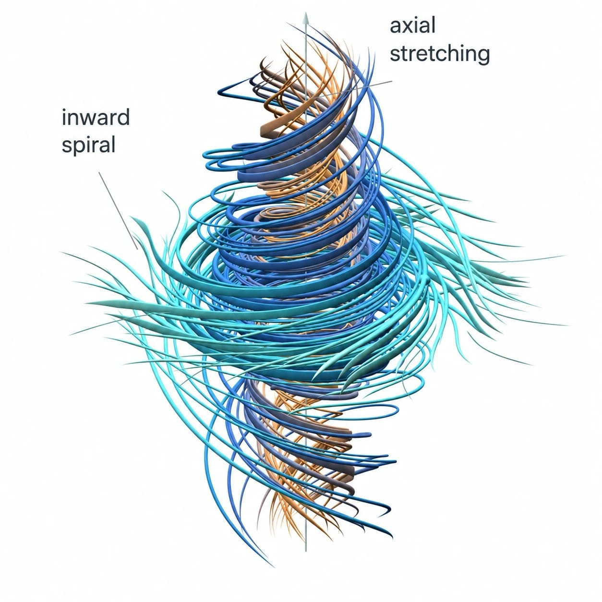
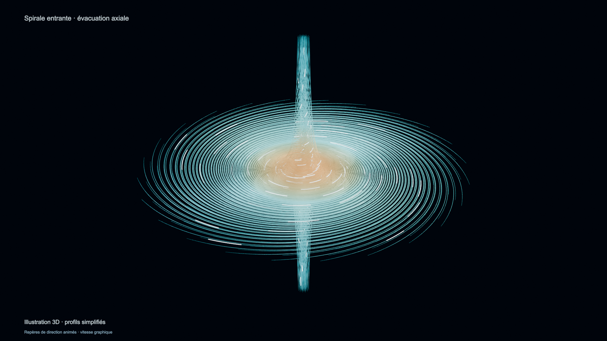

# Navier–Stokes · Explorer un vortex en 3D

Un projet de découverte pour mieux comprendre les mouvements d’un fluide : une spirale qui se resserre, un cœur tourbillonnant et un écoulement qui s’étire le long de son axe. Il rassemble des explications en français, des visualisations interactives et des animations 3D.

  

*Illustration de référence associée à l’[annonce d’OpenAI](https://openai.com/index/navier-stokes-solution/). Cette image sert de point de départ visuel ; ce n’est pas un rendu calculé par ce projet.*

## Explorer le rendu

1. Télécharger le projet avec **Code → Download ZIP**, puis décompresser l’archive.
2. Ouvrir `output/immersive/EXPLORER_LE_VORTEX.html` dans un navigateur compatible WebGL. Le fichier fonctionne hors ligne, sans installation.
3. Faire glisser la souris pour tourner autour du vortex, utiliser la molette pour zoomer, puis essayer la lecture, la demi-coupe et le suivi du cœur.

Sur Mac, le lanceur `OUVRIR_LE_VORTEX.command` permet aussi d’ouvrir la visualisation. GitHub affiche le code du fichier HTML ; il faut le télécharger pour utiliser le rendu interactif.

- [Voir ou télécharger la vidéo](output/immersive/animation_immersive.mp4)
- [Télécharger la scène Blender](output/immersive/vortex_immersif.blend)
- [Lire le guide du rendu immersif](RENDU_IMMERSIF.md)

## Que représente cette géométrie ?

Les courbes donnent à voir un mouvement en spirale vers le cœur, puis une évacuation suivant l’axe. Elles aident à comprendre l’organisation de l’écoulement ; ce ne sont pas des couches solides de matière.

**Le rendu immersif est un modèle pédagogique simplifié.** Il ne reconstitue pas la solution complète du travail cité et ne démontre pas l’apparition d’une singularité. Le resserrement et le zoom servent à explorer une idée géométrique, sans prétendre représenter exactement ce qui se passe à l’instant singulier.

## Pour aller plus loin

- [Sources, annonce et précautions d’interprétation](ANNONCE_ET_GEOMETRIE.md)
- [Plan de réalisation 3D](PLAN_RENDU_3D.md)
- [Premier rendu et comparaison mathématique exploratoire](RENDU_3D.md)
- [Limites du profil mathématique utilisé](rendering/profile_audit.md)
- [Dépôt scientifique original d’OpenAI](https://github.com/openai/NavierStokesAndEuler), conservé séparément de ce projet.

Les rendus utilisent **Python, Three.js et Blender**. Les outils et dépendances nécessaires à leur régénération ne sont pas inclus dans le dépôt.

Les remarques sont bienvenues dans les **Issues**. Pour proposer une modification, créer un fork puis une **pull request** afin de pouvoir en discuter avant son intégration.
